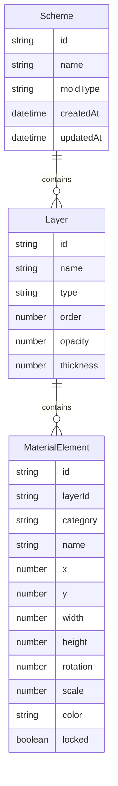

## 1. 架构设计

```mermaid
graph TB
    "React前端" --> "Zustand状态管理"
    "Zustand状态管理" --> "localStorage持久化"
    "React前端" --> "Canvas画布渲染"
    "Canvas画布渲染" --> "材料元素拖拽"
    "React前端" --> "固化时间计算引擎"
    "固化时间计算引擎" --> "风险检测模块"
    "React前端" --> "导出模块"
    "导出模块" --> "html2canvas排版图导出"
    "导出模块" --> "材料清单打印"
```

## 2. 技术说明

- 前端：React@18 + TypeScript + Tailwind CSS@3 + Vite
- 初始化工具：vite-init (react-ts 模板)
- 状态管理：Zustand（含 persist 中间件存储方案到 localStorage）
- 画布：HTML5 Canvas（材料元素渲染与交互）
- 拖拽：原生 Drag & Drop API + Canvas 交互事件
- 导出：html2canvas（排版图PNG导出）+ 原生 window.print（材料清单打印）
- 后端：无（纯前端应用）
- 数据库：无（localStorage 存储）

## 3. 路由定义

| 路由 | 用途 |
|------|------|
| / | 主工作台（模具画布+素材库+层级面板+固化提示） |

## 4. 数据模型

### 4.1 数据模型定义



### 4.2 核心类型定义

```typescript
type MoldType = 'pendant' | 'hairclip' | 'ring' | 'coaster'

type MaterialCategory = 'driedFlower' | 'glitter' | 'goldFoil' | 'colorPowder'

interface Scheme {
  id: string
  name: string
  moldType: MoldType
  layers: Layer[]
  createdAt: number
  updatedAt: number
}

interface Layer {
  id: string
  name: string
  type: MaterialCategory
  order: number
  opacity: number
  thickness: number
  elements: MaterialElement[]
}

interface MaterialElement {
  id: string
  layerId: string
  category: MaterialCategory
  name: string
  x: number
  y: number
  width: number
  height: number
  rotation: number
  scale: number
  color: string
  locked: boolean
}

interface CuringEstimate {
  totalHours: number
  layerDetails: LayerCuringInfo[]
  warnings: Warning[]
}

interface LayerCuringInfo {
  layerId: string
  layerName: string
  hours: number
  thickness: number
}

interface Warning {
  type: 'occlusion' | 'bubble' | 'gravity'
  level: 'info' | 'warning' | 'danger'
  message: string
  layerId?: string
}
```

## 5. 固化时间计算逻辑

- 基础固化时间：每1mm厚度约需8-12小时（环氧树脂标准）
- 层数叠加：每增加一层，总时间增加该层固化时间
- 亮片/金箔层：因不透气的金属材质，气泡风险+1级
- 色粉层：色粉添加量越多，固化时间延长5-15%
- 干花层：干花可能含水分，增加气泡风险+1级
- 重心偏移：当材料质量分布偏离模具中心超过30%时触发

## 6. 关键技术方案

### 6.1 画布交互

- Canvas 绘制模具轮廓和材料元素
- 鼠标事件实现选中和拖拽移动
- 选中元素显示控制点（缩放/旋转）
- 支持键盘方向键微调位置

### 6.2 层级管理

- 层级列表使用拖拽排序
- 每层独立透明度和厚度参数
- 层级顺序决定 Canvas 绘制顺序（底层先画）

### 6.3 方案持久化

- 使用 Zustand persist 中间件自动保存当前方案
- 方案列表存储在 localStorage
- 支持多方案管理（增删改查）
